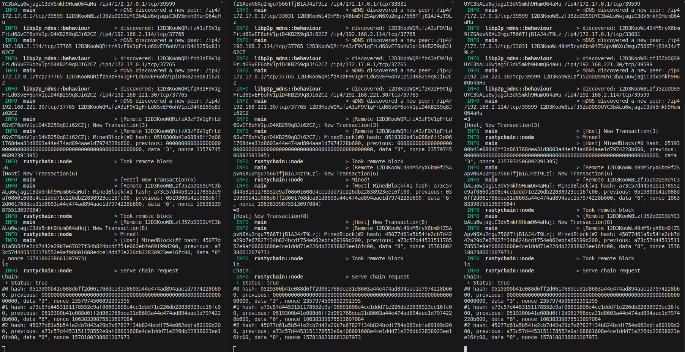
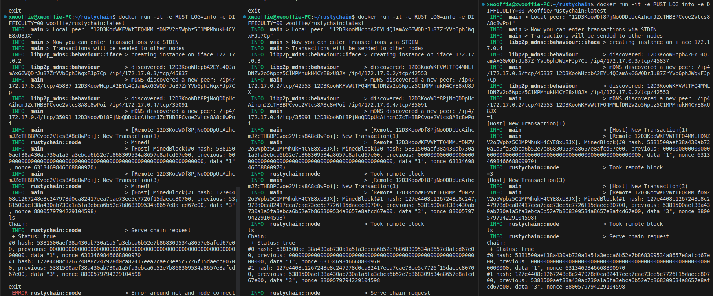
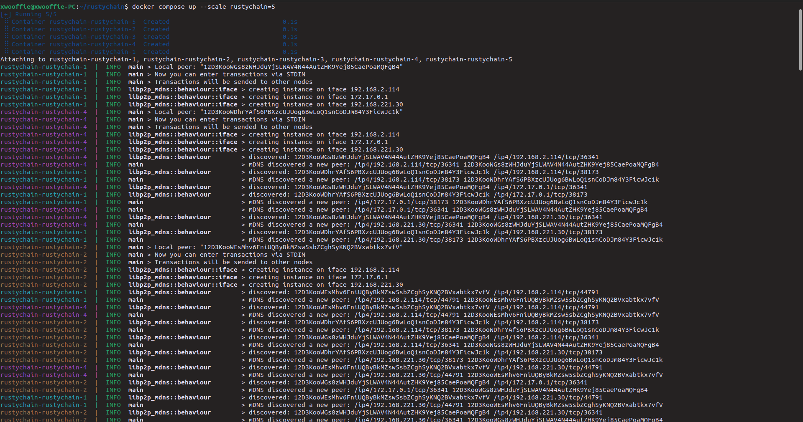
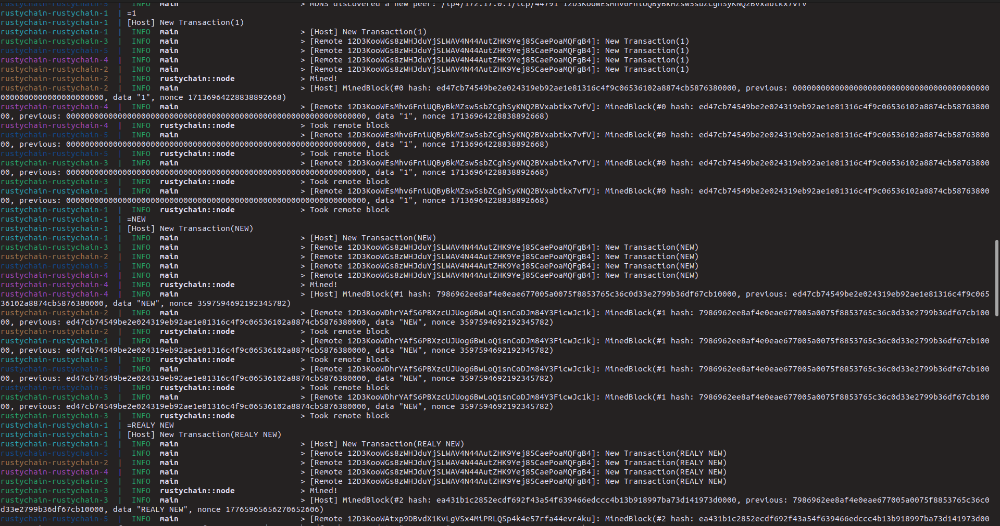
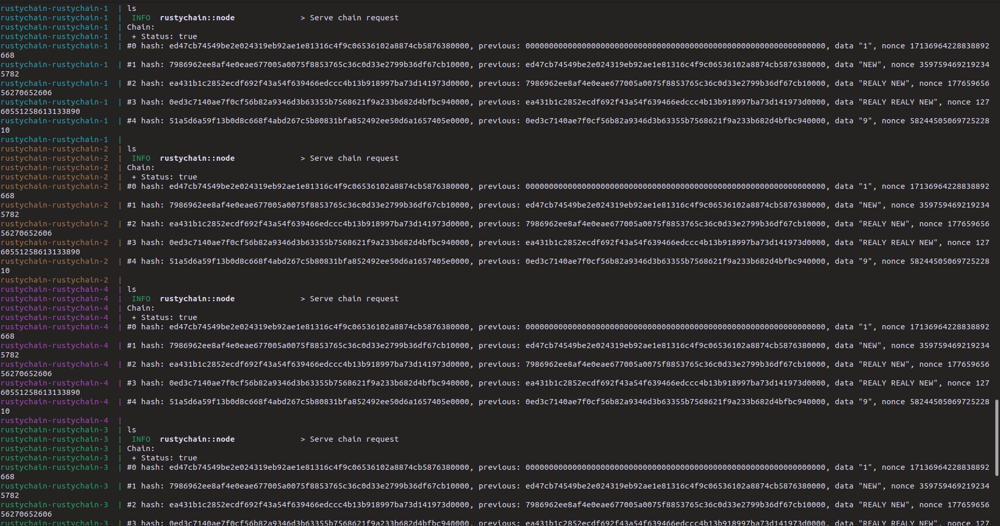
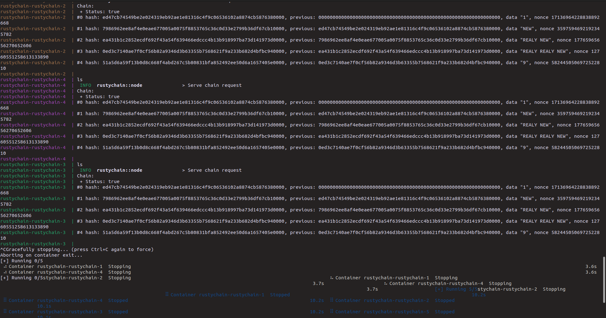

# Rusty Chain

| Tests | Lint | Dockerhub publish |
| -------- | -------- | -------- |
| [](https://github.com/wooffie/rustychain/actions/workflows/rust-tests.yml) | [](https://github.com/wooffie/rustychain/actions/workflows/rust-lint.yml) | [](https://github.com/wooffie/rustychain/actions/workflows/docker-pulish.yml) |

Proof of Work блокчейн, разработанный в рамках дисциплин СПбПУ.


## Содержание

- [Описание](#Описание)
- [Документация](#документация)
- [Установка и использование](#установка-и-использование)
- [Тестирование](#тестирование)
- [Лицензия](#лицензия)

## Описание

 Разработанный проект представляет собой узел блокчейна. Когда узел получает новую транзакцию, создаётся новый блок с полями: `id`, `data` (сюда вставляется транзакция), `hash`, `prev`(предыдущий хэш), `nonce`. Далее начинается подбор `nonce`. Данное поля должно стать таким, чтобы при вычисления хэша блока (SHA-256 от конкатинации всех полей), хэш оканчивался на заданную последовательность (например "0000"). 

 Кроме того, все узлы находятся в одноранговой сети, в которой все участники равноправны (peer to peer). Если какой-то узел уже посчитал `nonce`, то результат отправяется в сеть, а другие узлы, могут валидировать результат и взять его себе, если ещё не посчитали необходимый `nonce`. Также если возникают конфликты, узлы должны разобраться чей результат брать.

## Документация

Для большинства структур и функций проекта имеется документация с примерами в HTML формате. Для её открытия достаточно воспользоваться менеджером пакетов cargo. 

```bash
cargo doc --open
```
После выполнения команды открывается стандартное средство для просмотра HTML документов.

## Установка и использование

Существует 3 опции:
- запуск в терминале
- сборка образа Docker
- использование готового образа Docker

Программа принимает на вход только желаемую концовку хэша при вычислении блоков. Для этого можно использовать аргумент `-d 0000`, `--difficulty 0000` или переменную окружения `DIFFICULTY=0000`.

Используется логирование. Для наблюдений работы программы советуется установить переменную окружения `RUST_LOG=info`.

При запуске в терминале открывается входной поток, с помощью которого можно взаимодействовать с узлом.

- "ls" - вывод текущего состояния цепи на узле
- "exit" - завершения работы узла и выход из программы
- "=transaction" - добавление транзакции в сеть

_*Перед началом использования первого и второго способа необходимо клонировать репозиторий. Для демонтрационного варианта необходимо скопировать себе файл конфигурации [Docker Compose](docker-compose.yml)*_

### Запуск в терминале
*Данный способ требует наличие компилятора `rustc` и менеджера `cargo`.*

Компиляция и запуск:
```bash
cargo build --release

[RUST_LOG=info] ./target/release/main
#or
[RUST_LOG=info] ./target/release/main -d FEE1DEAD
#or
[RUST_LOG=info] DIFFICULTY=DEADFACE ./target/release/main
```

Совмещенный вариант:

```bash
[RUST_LOG=info] cargo run --release -- -d DEADC0DE
```




### Сборка образа Docker
*Данный способ требует наличие установленной платформы Docker.*

 Сборка образа:
 ```bash
docker build -t wooffie/rustychain:latest .
 ```
 Запуск:
 ```
 docker run -it -e RUST_LOG=info -e DIFFICULTY=DEFEC8ED wooffie/rustychain:latest
 ```



### Использование готового образа
*Данный способ требует наличие установленной платформы Docker.*

Также можно использовать образ с [Dockerhub](https://hub.docker.com/repository/docker/wooffie/rustychain).
```
docker pull wooffie/rustychain:latest

docker run -it -e RUST_LOG=info -e DIFFICULTY=DEADBEEF wooffie/rustychain:latest
```


### Демонстрационный вариант
*Данный способ требует наличие установленной платформы Docker и Docker Compose.*

Подготовлен вариант запуска большого количества узлов при помощи Docker Compose. Необходимо лишь указать нужное количество нод.
```bash
docker compose up --scale rustychain=5
```

Единственный минус в том, что для отправки транзакций необходимо присоединиться к потоку ввода-вывода одного из контейнера.
```bash
docker attach rustychain-rustychain-1
# input commands and tranasctions
```









## Тестирование

Для запуска тестов и док. тестов необходимо наличие менеджера `cargo`.
```bash
cargo test
```

Также можно проверить результаты тестов выполненых в [GithubActions](https://github.com/wooffie/rustychain/actions).

## Лицензия

Этот проект находится под лицензией [MIT License](LICENSE).